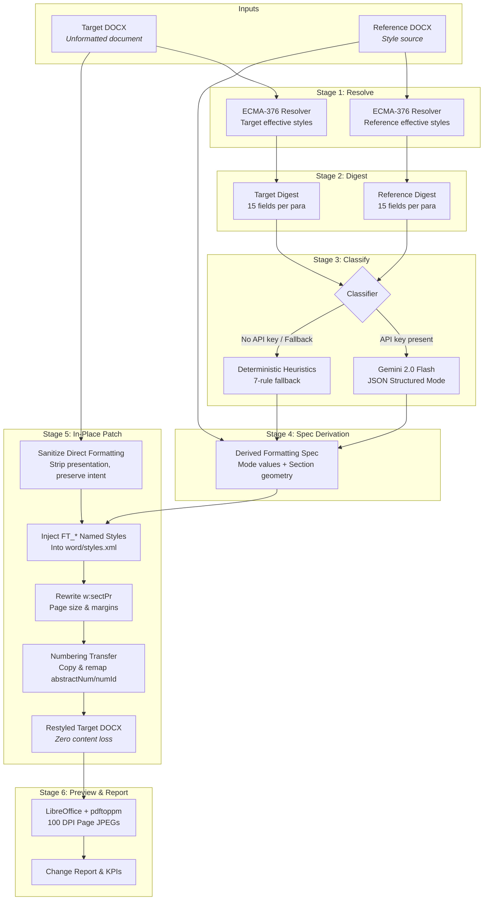

# Auto-Matter — DOCX Format Transfer Web App

**Auto-Matter** is a specialized web application that reformats Word documents (`.docx`) in-place by transferring the visual styles, typography, section geometry, and list formatting from a **reference** document to a **target** document, while guaranteeing **zero content or media loss**.

Unlike naive converters that extract text into Markdown or HTML and rebuild from scratch (destroying images, hyperlinks, equations, comments, and footnotes in the process), Auto-Matter directly manipulates the underlying ECMA-376 OOXML package, modifying only presentation properties.

---

## Key Features

- **In-Place OOXML Patching**: Operates directly on the unzipped `.docx` package XML. Authorial content, media files (`word/media/*`), external relationships (`hyperlinks`), and table structures remain 100% intact.
- **Presentation vs. Meaning Separation**:
    - **Presentation** (_font, size, alignment, margins, line/paragraph spacing_) is stripped and replaced with the reference document's derived specifications.
    - **Meaning** (_bold, italic, underline, strikethrough, superscript/subscript, highlights, hyperlinks_) is strictly preserved.
- **6-Layer Precedence Formatting Resolver**: ECMA-376 compliant cascade resolver that evaluates effective formatting across `docDefaults`, style `w:basedOn` inheritance chains, numbering-level properties, direct paragraph formatting, character styles, and run formatting.
- **Dual Classification Pipeline**:
    - **LLM Classifier (`gemini-2.0-flash`)**: Multi-document, single-call structured classification aligning both documents against a closed 15-role taxonomy with SHA-256 caching.
    - **Deterministic Rule-Based Fallback**: 7-stage heuristic classifier that functions with zero external API dependencies.
- **Mode-Based Style Aggregation**: Calculates statistical mode (not mean) for typography and spacing properties to avoid inventing non-existent font sizes (e.g., 22.4 pt).
- **Collision-Free List Transfer**: Copies `w:abstractNum` and `w:num` definitions between packages with automatic ID remapping and creates `numbering.xml` parts if absent.
- **Asynchronous API & Visual Previews**: FastAPI backend with background job queue, delivering page-by-page before/after previews via headless LibreOffice and `pdftoppm`.
- **Modern Two-Pane Web UI**: Next.js 14 + React 18 + Tailwind CSS interface with drag-and-drop validation, polling progress stepper, split-screen preview viewer, and detailed change reports.

---

## Architecture & Data Flow

Auto-Matter operates in five distinct pipeline stages:



---

## 15-Role Semantic Taxonomy

Both documents are classified into a single shared closed taxonomy:

| Semantic Role     | Description                                                  |
| ----------------- | ------------------------------------------------------------ |
| `title`           | Document title (top level)                                   |
| `subtitle`        | Secondary title below main title                             |
| `series_label`    | Metadata / kicker / category above title                     |
| `heading_1`       | Primary section heading                                      |
| `heading_2`       | Secondary subsection heading                                 |
| `heading_3`       | Tertiary heading level                                       |
| `body`            | Standard prose paragraph                                     |
| `quote`           | Blockquote / excerpt                                         |
| `reference_line`  | Citation / source line (e.g., Scripture or author reference) |
| `list_item`       | Bulleted or numbered list item                               |
| `table_caption`   | Table caption / description                                  |
| `caption`         | Image / figure caption                                       |
| `definition_term` | Defined term in a list or glossary                           |
| `definition_meta` | Pronunciation / part of speech / descriptor                  |
| `aim`             | Learning objective or goal callout                           |

---

## Project Structure

```
auto-matter/
├── backend/
│   ├── app/
│   │   ├── classify/
│   │   │   ├── fallback.py        # Deterministic 7-rule heuristic classifier
│   │   │   ├── llm.py             # Gemini 2.0 Flash structured classifier & cache
│   │   │   └── taxonomy.py        # Closed 15-role Enum & validation
│   │   ├── ooxml/
│   │   │   ├── constants.py       # OOXML namespaces & schema-mandated element orders
│   │   │   ├── inventory.py       # Stage 2 compact paragraph digest generator
│   │   │   ├── numbering.py       # Stage 5e list definition copying & numId remapping
│   │   │   ├── package.py         # Zip archive wrapper & byte-identical round-tripper
│   │   │   ├── resolver.py        # Stage 1 6-layer formatting cascade engine
│   │   │   ├── restyle.py         # Stage 5 patch orchestrator & FT_* style injector
│   │   │   ├── sanitize.py        # Stage 5a presentation property stripper
│   │   │   └── spec.py            # Stage 4 mode-based formatting spec derivation
│   │   ├── jobs.py                # In-memory job state & background thread runner
│   │   ├── main.py                # FastAPI endpoints & CORS middleware
│   │   └── render.py              # Headless LibreOffice + pdftoppm rasteriser
│   ├── tests/
│   │   ├── fixtures/
│   │   │   ├── climate_original.docx   # Messy source test document
│   │   │   └── climate_reference.docx  # Hand-formatted target look
│   │   ├── conftest.py            # Session-level fixtures
│   │   ├── test_acceptance.py     # End-to-end ground truth acceptance tests (§12)
│   │   ├── test_api.py            # FastAPI route and validation tests
│   │   ├── test_inventory.py      # Digest and taxonomy tests
│   │   ├── test_llm.py            # LLM prompt, caching, and fallback tests
│   │   ├── test_numbering.py      # Numbering transfer & remap tests
│   │   ├── test_package.py        # Zip archive & byte-identical tests
│   │   ├── test_render.py         # Preview generation & pdftoppm tests
│   │   ├── test_resolver.py       # Precedence resolution & edge-case tests
│   │   ├── test_restyle.py        # Sanitise, style injection, & patch tests
│   │   └── test_spec.py           # Specification derivation & mode tests
│   ├── Dockerfile                 # Python 3.12 + LibreOffice + Poppler container
│   └── requirements.txt
├── frontend/
│   ├── app/
│   │   ├── components/
│   │   │   ├── ChangeReport.tsx   # Changes breakdown table, metrics, & download
│   │   │   ├── DropZone.tsx       # Drag-and-drop dual document uploader
│   │   │   └── PreviewPane.tsx    # Synchronized split-screen page previewer
│   │   ├── globals.css
│   │   ├── layout.tsx
│   │   └── page.tsx               # Primary application page with state polling
│   ├── next.config.mjs            # Next.js configuration with API proxy rewrites
│   ├── package.json
│   ├── postcss.config.mjs
│   ├── tailwind.config.ts
│   └── tsconfig.json
├── docker-compose.yml
├── SPEC.md                        # Authoritative technical specification
└── README.md                      # This documentation
```

---

## API Contract

All endpoints run on the backend (`http://localhost:8000` or via frontend rewrite `/api/*`).

### 1. Initiate Conversion

```http
POST /api/convert
Content-Type: multipart/form-data
```

**Form Fields:**

- `target`: `.docx` file (the document to be restyled, max 50 MB)
- `reference`: `.docx` file (the document providing the visual styles, max 50 MB)

**Response:** `202 Accepted`

```json
{
    "jobId": "b18b4e72-97b7-4b68-99ee-799c759f271a"
}
```

**Error Responses:**

- `400 Bad Request`: Non-DOCX extension, file > 50 MB, empty file, or corrupt zip archive missing `word/document.xml`.

---

### 2. Poll Job Status & Change Report

```http
GET /api/jobs/{jobId}
```

**Response:** `200 OK`

```json
{
    "status": "done",
    "report": {
        "sectionChanges": {
            "pageSize": true,
            "margins": true,
            "headerFooterRemoved": true
        },
        "roles": [
            {
                "role": "body",
                "paragraphCount": 14,
                "specApplied": {
                    "font": "Times New Roman",
                    "size_pt": 22.0,
                    "bold": false,
                    "italic": false,
                    "alignment": "both",
                    "space_before": 0,
                    "space_after": 160,
                    "line_spacing": 360
                },
                "source": "reference"
            },
            {
                "role": "heading_1",
                "paragraphCount": 10,
                "specApplied": {
                    "font": "Times New Roman",
                    "size_pt": 22.0,
                    "bold": true,
                    "italic": false,
                    "alignment": "left",
                    "space_before": 400,
                    "space_after": 160,
                    "line_spacing": 360
                },
                "source": "reference"
            }
        ],
        "warnings": [],
        "classifier": "fallback"
    },
    "previews": {
        "before": [
            "/api/jobs/b18b4e72-97b7-4b68-99ee-799c759f271a/preview/before/page-00001.jpg"
        ],
        "after": [
            "/api/jobs/b18b4e72-97b7-4b68-99ee-799c759f271a/preview/after/page-00001.jpg"
        ]
    },
    "downloadUrl": "/api/jobs/b18b4e72-97b7-4b68-99ee-799c759f271a/download"
}
```

---

### 3. Download Restyled Document

```http
GET /api/jobs/{jobId}/download
```

**Response:** `200 OK` with `Content-Type: application/vnd.openxmlformats-officedocument.wordprocessingml.document` (attachment `restyled.docx`).

---

### 4. Fetch Page Preview Image

```http
GET /api/jobs/{jobId}/preview/{side}/{filename}
```

**Parameters:**

- `side`: `"before"` or `"after"`
- `filename`: `page-00001.jpg` (validated against regex `^page-\d+\.jpg$`)

**Response:** `200 OK` with `Content-Type: image/jpeg`.

---

### 5. Purge Job Data

```http
DELETE /api/jobs/{jobId}
```

**Response:** `200 OK`

```json
{
    "status": "deleted"
}
```

Removes all associated temporary files and preview directories from disk.

---

## Environment Variables

| Variable         | Scope    | Default                 | Description                                                                                                      |
| ---------------- | -------- | ----------------------- | ---------------------------------------------------------------------------------------------------------------- |
| `GOOGLE_API_KEY` | Backend  | _(None)_                | Google Gemini API key for structured LLM classification. If unset, deterministic fallback is automatically used. |
| `JOB_DIR`        | Backend  | System `/tmp`           | Root folder for saving temporary uploads, outputs, and preview images.                                           |
| `PORT`           | Backend  | `8000`                  | Port for the FastAPI uvicorn server.                                                                             |
| `BACKEND_URL`    | Frontend | `http://localhost:8000` | URL of the backend API used by Next.js rewrites.                                                                 |

---

## Getting Started

### 1. Prerequisites

- **Python**: 3.11 or higher
- **Node.js**: 18+ (for frontend)
- **Poppler & LibreOffice** (optional for local previews; bundled in Docker):
    - Ubuntu/Debian: `sudo apt-get install libreoffice poppler-utils`

---

### 2. Running Locally

#### Backend:

```bash
cd backend
# Note: On Debian/Ubuntu (PEP 668), pass --break-system-packages or configure pip.conf
pip install -r requirements.txt

# (Optional) Export your Gemini API key:
export GOOGLE_API_KEY="your-api-key"

# Start FastAPI server on port 8000:
python3 -m uvicorn app.main:app --reload --port 8000
```

#### Frontend:

```bash
cd frontend
npm install
npm run dev
```

Open [http://localhost:3000](http://localhost:3000) in your browser.

---

### 3. Running with Docker Compose

To run the complete containerized environment with headless LibreOffice and Poppler preconfigured:

```bash
docker-compose up --build
```

- Frontend UI: [http://localhost:3000](http://localhost:3000)
- Backend Docs: [http://localhost:8000/docs](http://localhost:8000/docs)

---

## Verification & Testing

The backend includes a comprehensive pytest suite covering all OOXML edge cases, ECMA-376 schema constraints, and full pipeline integration.

Run the test suite:

```bash
pytest backend/tests/ -v
```

### Test Suite Summary

- **239 passing unit and integration tests**
- **10 Acceptance Tests ([`test_acceptance.py`](file:///home/kbg/dev/auto-matter/backend/tests/test_acceptance.py))**:
    - Verifies exact reformatting of `climate_original.docx` into `climate_reference.docx`.
    - Asserts that all 6 original hyperlink relationships (`http://rent21.org/`, `http://nasa.gov/`, etc.) resolve identically in the output.
    - Confirms zero lost text runs across all 41 paragraphs.
    - Verifies page size (`12240 × 20160` twips) and margin settings (`720` twips on all four sides).
    - Verifies removal of unused header/footer references in section properties.
    - Confirms non-colliding `abstractNum` and `numId` copying in `numbering.xml`.
